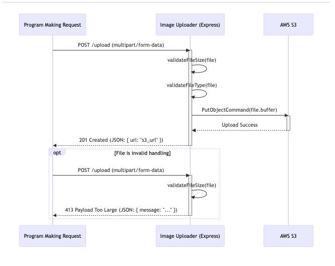

# Image Uploader Microservice

A simple, dedicated microservice for handling image uploads. This service receives image files, validates them, and uploads them directly to an AWS S3 bucket, returning a public URL.
This service is intended to be used by client applications by Group 19 applications that need a simple, centralized image-handling solution.


## Communication Contract

This service provides one primary endpoint for uploading images.

### How to REQUEST Data (Upload an Image)

You must send image data to the `/upload` endpoint using the `POST` method and a `multipart/form-data` content type.

* **Endpoint:** `POST /upload`
* **Method:** `POST`
* **Body Type:** `multipart/form-data`
* **Required Field:** The image file **must** be sent under the form field key `image`.

#### Validation Rules (Enforced by Server)

* **File Type:** Must be `image/jpeg` or `image/png`.
* **File Size:** Must be 5MB or less.

#### Example Call (JavaScript `fetch`)

This example shows how a client application would upload a file.

```javascript
// 'file' is the file object from an image picker (it must have 'uri', 'type', and 'name')
const fileToUpload = {
  uri: file.uri,
  type: file.mimetype, // e.g., 'image/jpeg'
  name: file.originalname || 'upload.jpg',
};

// 1. Create the FormData
const formData = new FormData();
formData.append('image', fileToUpload);

// NOTE: this will be updated once I host the service
const serviceUrl = 'http://localhost:3001/upload';

try {
  // 2. Make the POST request
  const response = await fetch(serviceUrl, {
    method: 'POST',
    body: formData,
    headers: {
      // The 'Content-Type': 'multipart/form-data' header
      // is set automatically by fetch when using FormData.
    },
  });

  // See the "How to RECEIVE Data" section for how to handle the response
  const responseData = await response.json();

  if (response.ok) {
    console.log('Upload successful! URL:', responseData.url);
  } else {
    console.error('Upload failed:', responseData.message);
  }

} catch (error) {
  console.error('Network error:', error.message);
}
```
---
### How to RECEIVE Data (Handle the Response)

The microservice will always respond with a `JSON` object.

#### On Success (HTTP Status `201 Created`)

If the file is successfully validated and uploaded, the service will return a JSON object containing the public URL of the file in S3.

**Example Response Body:**

```json
{
  "success": true,
  "message": "File uploaded successfully",
  "url": "https://s3.us-west-2.amazonaws.com/some-bucket-name/123456789-image.jpg"
}
```

---

## Getting Started: Running the Service Locally

1.  **Install dependencies:**
    ```bash
    npm install
    ```

2.  **Set up environment:**
    Create a `.env` file in the root and populate it with your AWS credentials

    ```.env
    AWS_ACCESS_KEY_ID=YOUR_AWS_ACCESS_KEY_HERE
    AWS_SECRET_ACCESS_KEY=YOUR_AWS_SECRET_KEY_HERE
    AWS_REGION=your-s3-bucket-region (e.g., us-west-2)
    S3_BUCKET_NAME=your-unique-s3-bucket-name
    ```

3.  **Start the server:**
    ```bash
    npm start
    ```
    The service will be running on `http://localhost:3001`.

## UML Sequence Diagram
